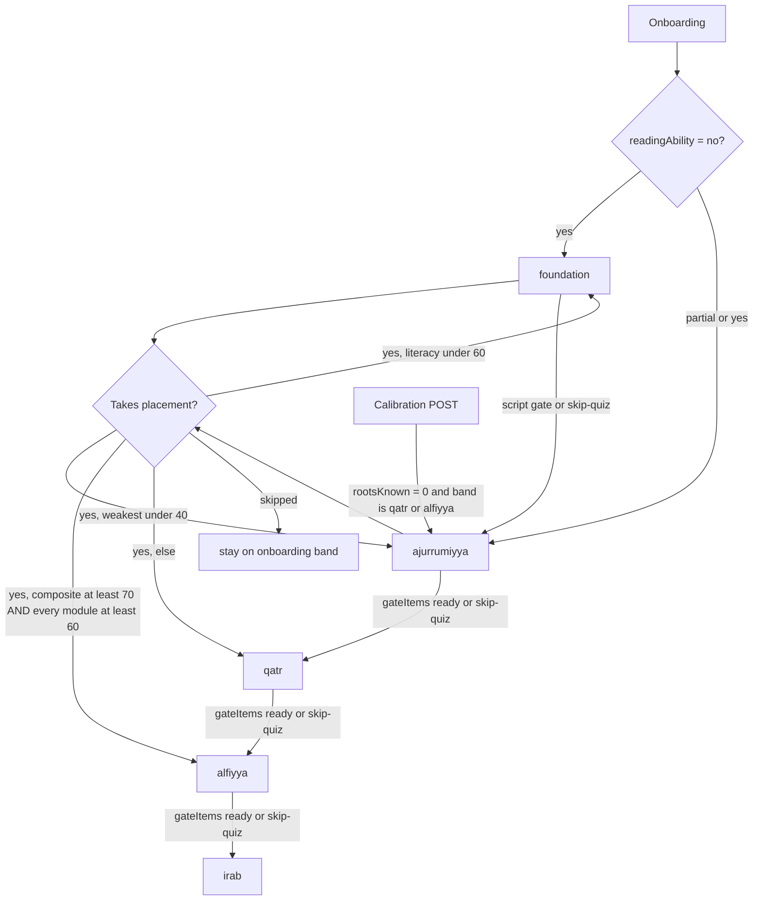
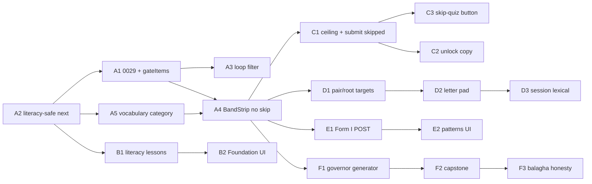

# Beginner → Advanced Path — Program of Plans for Bayan

| Field | Value |
|---|---|
| **Title** | Beginner → Advanced Classical Arabic Path inside Bayan |
| **Author** | TBD |
| **Date** | 2026-08-15 |
| **Status** | Draft |
| **Extends** | `.hermes/plans/2026-08-08_213000-daily-loop-to-advanced-arabic.md` |
| **Durable copy** | `.hermes/plans/2026-08-15_BEGINNER-TO-ADVANCED-PATH.md` |
| **Audience** | Senior engineers shipping the next volumes of Bayan |

This document is a **program of plans**, not one feature PR. Plan 0 is the charter. Volumes A–F are independently shippable. The PR Plan at the bottom sequences implementation across volumes.

---

## Overview

Bayan already ships a daily loop: placement, root calibration, a 25-minute mixed sitting on `/session`, FSRS-6 hifz with typed recall, function-word known state, a root × wazn grid, tashkil production, elided-فاعل drills, freeflow at ≥98% coverage, and a corpus-grounded tutor. The 2026-08-08 pedagogy plan still stands: recognition plus self-report will not produce advanced readers, and iʿrāb is the capstone skill. This program collects case, token-governor, and elision. The marker is out of scope (0.1).

The app still has no explicit beginner → advanced **curriculum spine**. `users.current_path` stores `path1` / `path2` / `path3` from `assignLearningPath()` in `workers/src/lib/scoring.ts`. `GET /api/learning/next` ignores that column and walks every lesson by `level ASC, id ASC`. After `grammar-03`, the next row is `root-Alh`: 12 generated root lessons sit at level 1, and only `root-Alh` has empty prerequisites, so it sorts ahead of every level-2 authored id. (Levels in `root-lessons.json`: 1:12, 2:35, 3:89, 4:272. After those 12 level-1 roots, `grammar-04` wins the sort again.) A true beginner who cannot decode script is one tap from treebank iʿrāb. Progress shows a bag of exercise kinds. Nothing on Today says "you are here" in a language a madrasa student would recognise.

This program adds five **bands** that map onto named traditional curricula, assigns a band from the signals the app already collects, draws session content from the current band, gates authored lessons in order, and shows a "you are here" strip on Today and Progress. It extends `/today`, `/session`, `/progress`, `/learning`, and `/grammar`. It does not invent a second app.

---

## Background & Motivation

### What already ships (verified 2026-08-15)

| Surface | What it does | File |
|---|---|---|
| Six-item nav | Today, Read, Memorize, Grammar, Tutor, Progress | `src/app/components/layout/Nav.tsx` |
| Today | One gold primary action: calibrate if 0 roots, else `/session` if hifz is due, else next-root | `src/app/components/today/Today.tsx` |
| `/session` | 25-minute mix (`TARGET_SECONDS = 1500`). Typed hifz via `ReviewSession` → `gradeFromAccuracy`. Then function words, intensive i+1, tashkil, elided فاعل, freeflow. Reflection reorders the next sitting. | `workers/src/routes/session.ts`, `src/app/components/session/MixedSessionRunner.tsx` |
| Placement | 18 questions, four modules, skippable from onboarding | `content/assessments/placement-test.json`, `Onboarding.tsx` |
| Calibration | 12 roots sampled across frequency ranks; optional `fillToRank` | `GET/POST /api/progress/calibration` |
| Coverage | An ayah is readable when every rooted word **and** every function-word `(lemma, pos)` is known | `GET /api/progress/coverage` |
| Authored lessons | 11 rows in `content/grammar/lessons.json` (`grammar-01` … `grammar-11`) | categories `nahw` / `sarf` / `balagha` |
| Generated lessons | 408 per-root families in `content/grammar/root-lessons.json` | `module: "grammar"`, no `category` |
| Exercise bank | 38,995 rows, 25+ kinds including `elided_subject` (live from `quran_syntax`) | `grammar_exercise_bank` |
| Known-state tables | `user_known_root`, `user_known_function_word` (0023), `user_known_pattern` (0024) | migrations 0017, 0023, 0024 |
| Production already live | Tashkil tap palette (`TashkilDrill`), typed hifz, fill-blank "type the root" inside root lessons | `workers/src/lib/tashkil.ts` |
| Last migration | 0028 `user_sessions.reflection` | `0028_session_reflection.sql` |

AGENTS.md and `Today.tsx:238` still say "ten authored lessons". The file on disk has eleven (`grammar-11` is balagha). Cite eleven.

### The hole this program fills

Three facts, independently checkable:

1. **`current_path` is a label.** `POST /api/assessment/submit` and `POST /api/auth/onboarding` write `path1`/`path2`/`path3`. `GET /api/learning/next` never reads the column. `/learning` displays "Complete Beginner / Conversational Speaker / Advanced Reader" (`PATH_NAMES` in `src/app/app/learning/page.tsx`). Those names describe a 13-week MSA-flavoured brochure in `PATHS` (`scoring.ts:21–48`). They do not change what the learner studies.

2. **The two lesson tracks are one queue.** `PATH_ORDER = ['literacy', 'grammar', 'vocabulary', 'tajweed']` (`session.ts:76`, `learning.ts:207`). Every one of the 419 lessons has `module: "grammar"`. Literacy, vocabulary, and tajweed queues are empty. Twelve generated root lessons sit at level 1; `root-Alh` has empty prereqs, so it becomes next after `grammar-03`. The other 407 roots form a chain (`root-qwl` requires `root-Alh` at `root-lessons.json:131–133`). The collapse is real and shorter than “the 408 swallow the pointer forever.” The 2026-08 silo plan (`.hermes/plans/fix-root-lessons-silo.md`) correctly wanted the 408 reachable; Grammar already has a Vocabulary tab. Reachability is right. Collapsing them into the nahw pointer is the defect.

3. **The sitting is band-blind.** `loopItems()` always queues function words, intensive reading, tashkil, elided فاعل (if the treebank has any), and freeflow. A learner who failed `lit-01` ("which letter is ب") still gets "The unwritten فاعل".

The 2026-08-08 plan already named the skill ceiling. This document names the **sequence**: what week 1 studies, what year 3 studies, when nahw unlocks, when ṣarf unlocks, when balāgha unlocks, and how Progress says "you are here".

### Pain, in the learner's words

- A beginner who cannot join ب to ا is asked to name a case ending.
- A madrasa student who finished *al-Ajurrūmiyya* is offered sun and moon letters with no skip that writes a distinct state.
- An advanced reader who calibrated 400 roots still has no screen that says "this is Iʿrāb al-Qurʾān work".
- The gold card on Today is correct about *what is due*. It is silent about *which year of the path you are in*.

---

## Goals & Non-Goals

### Goals

1. One spine of five bands, each mapped to a named traditional curriculum, each with a measurable exit gate.
2. Placement and onboarding assign a **band**. Calibration may lower a band. Only a gate or a skip-quiz raises one.
3. Session content, authored-lesson unlock, and exercise-kind filters all read the current band.
4. Authored nahw/ṣarf/balāgha and generated root lessons are two tracks. Both stay reachable. Only the authored track drives "next lesson".
5. A "you are here" strip on Today and Progress, in the existing tokens (dark, gold = act, leaf = progress).
6. Empty states, skip, and "I already know this" at every band, so an advanced student is not trapped in sun/moon letters.
7. Typed Arabic uses the existing diacritic palette and a new 28-letter pad. No hardware Arabic keyboard is assumed.
8. Incremental PRs on existing routes. Migrations start at **0029**.

### Non-goals

- A seventh nav tile, a course-catalogue homepage, or a new top-level "Path" route.
- An MSA conversation course. ACTFL / CEFR speaking and listening descriptors are out of scope.
- Teaching the *mutūn* as texts to memorise (*Ajurrūmiyya* itself, the *Alfiyya* as verse).
- The 92 ARDT devices that are not derivable from data this repo trusts. Today only taqdīm (`fronting`), jinās, and tashbīh (`simile`) are derivable.
- ASR / recitation checking (struck, 2026-08-11).
- A daily streak counter (removed).
- LLM-as-source. Tutor remains corpus lookup.
- Replacing FSRS-6, the 25-minute sitting, or Today's one-gold-action rule.
- Inventing Arabic. Every new taught fact needs a gate or a corpus join.

---

# Plan 0 — Program charter

## 0.1 What "advanced" means here

A learner is **advanced** when they can open an ayah they have not studied, and for each content word name:

1. the case or mood (رفع / نصب / جر / جزم, or في محل … for the indeclinable),
2. the governor (عامل) that caused it, when that ʿāmil is a token in the sentence,
3. any elided فاعل the treebank reconstructs,

and retrieve a meaning without a gloss.

The classical fourth fact is the **marker** (ḍamma vs wāw vs alif, and so on). No morphology column names the marker separately from `case_case`. Volume F does not invent one. The `irab` sitting collects case and governor. A marker kind is out of scope until a closed set can be derived from form + `case_case` and cited to the corpus.

That is the skill of the *Iʿrāb al-Qurʾān* genre (e.g. al-Samin al-Halabi, *al-Durr al-Maṣūn*). It is a reading skill on a closed, fully vocalised corpus. ACTFL Advanced and CEFR C1 measure MSA speaking and listening. Bayan does not teach those.

The destination sentence, already in the 2026-08-08 plan: *open an unfamiliar ayah, parse it, understand it without help.*

## 0.2 The five bands

One spine. Arabic id is the stable key. English label is UI. Traditional book is the skill-equivalent, not a text the app recites.

| id | Compact strip | Traditional equivalent | Blocking exit items (see `gateItems` in A.1) | Typical time* |
|---|---|---|---|---|
| `foundation` | Script | Before the dars. *al-ʿArabiyya bayna Yadayk* vol. 1 unit 1; Madinah Book 1 lessons 1–3; *al-Kitāb* alphabet appendix | Script quiz ≥70% on 8 placement-literacy items, **or** every `literacy-%` row complete/skipped once those rows exist. `readingAbility` is not stored and is not a gate. | 1–4 weeks |
| `ajurrumiyya` | Ajurrūm | *al-Ajurrūmiyya* for the nahw rows that actually match. Ṣarf: *Bināʾ al-Afʿāl* for `grammar-02` | `grammar-01`, `02`, `03`, `05`, `06` complete or skipped; 20 function-word **pairs** known (top 20 by the live `/function-words` query); 63 roots known; rolling ≥70% on last 20 graded `pos_id` + `sentence_type` + `case_ending` items | 2–4 months |
| `qatr` | Qaṭr | *Qaṭr al-Nadā* / *Shudhūr al-Dhahab* as the next nahw book-equivalent. Ṣarf: *Shadhā al-ʿArf* for `grammar-04`, `08` | `grammar-04`, `07`, `08`, `09`, `10` complete or skipped; 50 function-word pairs known; 200 roots known; rolling ≥70% on last 20 graded `negation` + `demonstrative` + `mood` + `idafa`. Tashkil is **deferred** until `POST /api/grammar/tashkil` writes `grammar_exercises` (it does not today). | 4–8 months |
| `alfiyya` | Alfiyya | *Alfiyyat Ibn Mālik* + Ibn ʿAqīl as a **skill checklist of kinds**, not a verse. Ṣarf: *Lāmiyyat al-Afʿāl*. Balāgha door: `grammar-11` | `grammar-11` complete or skipped; rolling ≥70% on last 20 of each of `elided_subject`, `subject_word`, `object`, `mubtada_khabar`; Forms II, III, IV, V, VIII, X marked known. `homograph` is **deferred** until `COUNT(*) > 0` for that kind in `grammar_exercise_bank` (the shipped manifest has zero). `governor` is **deferred** until Volume F inserts that kind. | 6–12 months |
| `irab` | Iʿrāb | Capstone genre (*al-Durr al-Maṣūn*). Balāgha: three derivable devices only | No advance. Diagnostic: 10 cold-parses at ≥80% case+governor (+ elision when present); a freeflow run exists; `fronting` / `jinas` / `simile` attempted | Destination. |

\*Planning range for one daily 25-minute sitting, not a promise. Coverage clock, measured: 63 roots = 50.3% of rooted tokens (2026-08-08 daily-loop plan). 400 roots = 88.5% of rooted tokens. Ayahs-readable also needs the band’s particle target. Roots-only, 400 roots ≈ 3,044 / 6,236 ayahs. After the function-word AND: 244 ayahs with 0 particles, 2,511–2,743 with the top 50 pairs (BUILD-SLICES Task 3).

`gate.ready` is the A.1 function and only that function: `blocking.length > 0 && blocking.every(met)`. Ready is true when at least one item is blocking and every blocking item is `met`. All-deferred (Foundation before Volume B, no assessment, no script quiz) is **false**. `irab` (`gateItems` returns `[]`) is **false**. Deferred rows never keep ready false once a blocking item exists and is met.

**Nobody is placed into `irab`.** That band is earned. Placement may assign `alfiyya`. The first sitting still has to pass the `alfiyya` exit sample before the strip moves.

### Reading-only CEFR / ACTFL map

Use this table in Progress as a footnote, never as the band name.

| Band | ACTFL reading (only) | CEFR reading (only) |
|---|---|---|
| `foundation` | Novice Low | pre-A1 |
| `ajurrumiyya` | Novice Mid–High | A1–A2 |
| `qatr` | Intermediate Low–Mid | B1 |
| `alfiyya` | Intermediate High | B2 |
| `irab` | Advanced, **this corpus** | C1, **this corpus** |

Copy on that footnote: "These scales measure Modern Standard Arabic communication. Bayan teaches Classical reading of the Quran. The row is a reading descriptor only."

## 0.3 What we take from each curriculum, and what we refuse

| Source | Take | Refuse |
|---|---|---|
| *al-Ajurrūmiyya* | The chapters that already have a lesson or a bank kind (table 0.4). Unlock copy may name those chapters. | Kalām as a first lesson. Ism/fiʿl/ḥarf as a first nahw dars. Memorising the matn. |
| *Qaṭr al-Nadā* / *Shudhūr al-Dhahab* | Deeper iʿrāb via `case_ending` / `mood` / tashkil. Exceptions the Ajurrūmiyya skips, when a kind exists. | Nawāsikh (inna / kāna) as a taught chapter. No lesson and no bank kind covers them. Reciting Ibn Hishām. |
| *Alfiyyat Ibn Mālik* + Ibn ʿAqīl | A **checklist of existing kinds** (table 0.4 Alfiyya block). | Tawābiʿ as a chapter. A full manṣūbāt inventory. The 1,000-line verse. |
| *Hidāyat al-Naḥw* | A second confirmation of dars order when a named chapter is silent | A second beginner book on screen. |
| *Iʿrāb al-Qurʾān* (*al-Durr al-Maṣūn*) | Answer shape: case, token-governor, ḥadhf | Marker as a collected field. Importing the book. Model-written iʿrāb. |
| *Bināʾ al-Afʿāl* | `grammar-02` (māḍī). Form I as a grid column (Volume E). | Non-Quranic example verbs. Claiming `grammar-02` is an Ajurrūmiyya chapter. |
| *Shadhā al-ʿArf* | `grammar-04`, `grammar-08`; `derived_noun` / `verb_form` kinds | Teaching a tendency as a rule. Lexicalised exceptions (استطاع) stay marked. |
| *Lāmiyyat al-Afʿāl* | Forms V–XII as a short list on `/patterns`; six forms cover 99% of Quranic verb stems | The poem. |
| *Talkhīṣ al-Miftāḥ* / *Mukhtaṣar al-Maʿānī* / *Jawāhir al-Balāgha* / *al-Balāgha al-Wāḍiḥa* | Three-science labels; three derivable devices; `grammar-11` | 92 devices with no Quranic annotation. Metaphor and metonymy. |
| Sabaq / sabqi / manzil | Already in Bayan (`session.ts:100` keeps manzil off the mixed sitting). Keep. | Changing FSRS into a rotation-only scheduler. |
| Frequency-first (Hu & Nation 95%; Bayan's own counts) | 63-root token target; 20 / 50 **pair** targets from the live function-word query | “400 roots ≈ half the ayahs” under current coverage. “300 words = 70%”. Lemma percentages pasted onto pairs. |
| Understand Quran / "80% word lists" | Comparison column on Progress | A source of truth. A syllabus. |
| *al-ʿArabiyya bayna Yadayk*, *al-Kitāb*, Madinah books | Script-decoding sequence for `foundation` only | Dialogue, dialect, MSA speaking. |
| ACTFL / CEFR | Reading descriptors as a footnote | Band names. Speaking tests. Listening tests. |

## 0.4 Chapter → lesson map (verified ids only)

Verified titles, categories, levels, and prereqs from `content/grammar/lessons.json`. No new lesson ids appear in this table. `unauthored` means the chapter is not a row in that file.

Prerequisite graph (unchanged):

```
grammar-01  Articles / sun-moon          nahw  L1   []
 ├─ grammar-02  Māḍī conjugation         sarf  L1
 │    └─ grammar-04  Muḍāriʿ             sarf  L2
 │         ├─ grammar-08  Forms I–IV     sarf  L3
 │         └─ grammar-10  Negation       nahw  L3
 └─ grammar-03  Jumlah ismiyya           nahw  L1
      ├─ grammar-05  Iʿrāb basics        nahw  L2
      │    ├─ grammar-06  Iḍāfa          nahw  L2
      │    ├─ grammar-08  (also 05)
      │    └─ grammar-11  Balāgha        balagha L3
      ├─ grammar-07  Attached pronouns   nahw  L2
      └─ grammar-09  Demonstratives      nahw  L2
```

### Book chapter → existing artifact

| Book | Chapter / skill | Lesson id | Bank kind that stands in | Band that unlocks the lesson | Unlock copy may name the book? |
|---|---|---|---|---|---|
| — (literacy-adjacent) | Definite article / sun-moon letters | `grammar-01` | `definiteness` | `foundation` after literacy rows, else `ajurrumiyya` | No. Sun/moon is not an Ajurrūmiyya chapter. |
| *Bināʾ al-Afʿāl* | Māḍī | `grammar-02` | `aspect`, `subject_agreement` | `ajurrumiyya` | Yes, as ṣarf. |
| *al-Ajurrūmiyya* | جملة اسمية / mubtadaʾ + khabar | `grammar-03` | `sentence_type`, `mubtada_khabar` | `ajurrumiyya` | Yes. C.1 copy for `grammar-03` is fair. |
| *Bināʾ* / *Shadhā* | Muḍāriʿ | `grammar-04` | `aspect`, `mood` | `qatr` (prereq `grammar-02` may be done earlier) | Yes, as ṣarf. |
| *al-Ajurrūmiyya* | Iʿrāb (three cases) | `grammar-05` | `case_ending` | `ajurrumiyya` | Yes. |
| *al-Ajurrūmiyya* | Majrūrāt / iḍāfa | `grammar-06` | `idafa` | `ajurrumiyya` (moved here: 0.3 takes iḍāfa from this book) | Yes. |
| — | Attached pronouns | `grammar-07` | — | `qatr` | No book name. |
| *Shadhā al-ʿArf* | Forms I–IV | `grammar-08` | `verb_form`, `derived_noun` | `qatr` | Yes, as ṣarf. |
| — | Demonstratives | `grammar-09` | `demonstrative` | `qatr` | No book name. |
| — | Negation particles | `grammar-10` | `negation` | `qatr` | No book name. |
| *al-Balāgha al-Wāḍiḥa* door | Three derivable devices | `grammar-11` | `fronting`, `jinas`, `simile` | `alfiyya` | Yes, as balāgha. |
| *al-Ajurrūmiyya* | Kalām | `unauthored` | — | — | Do not teach this chapter. |
| *al-Ajurrūmiyya* | Ism / fiʿl / ḥarf as first dars | `unauthored` | `pos_id` | kinds from `ajurrumiyya` | Kind only. No “this is the kalām chapter”. |
| *al-Ajurrūmiyya* | Fāʿil | `unauthored` | `subject_word` (737, treebank Subj+NOM) | kinds from `alfiyya` (treebank) | Kind only. |
| *al-Ajurrūmiyya* | Mafʿūl bihi | `unauthored` | `object` (1,797, treebank Obj+ACC) | kinds from `alfiyya` | Kind only. |
| *al-Ajurrūmiyya* | Ḥarf jarr | `unauthored` | `pos_id` where `pos = P` | kinds from `ajurrumiyya` | Kind only. |
| *Qaṭr al-Nadā* | Nawāsikh (inna / kāna) | `unauthored` | none | — | Dropped from the take column. |
| *Alfiyya* | Tawābiʿ | `unauthored` | none | — | Dropped from the take column. |
| *Alfiyya* | ʿAwāmil / name the governor | `unauthored` | `governor` after Volume F | kinds from `alfiyya` | Yes, once the kind exists. |
| *Alfiyya* | Elided fāʿil | `unauthored` | `elided_subject` (live) | kinds from `alfiyya` | Yes. |

Volume C does **not** invent `grammar-12`. Missing chapters stay `unauthored` or stand in as kinds. A later volume may add authored rows; those ids are assigned at author time.

### Alfiyya skill checklist (kinds + the one lesson)

| Skill | Artifact | Status on 0028 |
|---|---|---|
| Nominal vs verbal sentence | `sentence_type` (252) | exists |
| Khabar | `mubtada_khabar` (825) | exists |
| Fāʿil | `subject_word` (737) | exists |
| Mafʿūl | `object` (1,797) | exists |
| Iḍāfa | `idafa` (1,221) + `grammar-06` | exists |
| Taqdīm | `fronting` (28) | exists |
| Ḥadhf of fāʿil | `elided_subject` | live, not in the bank CSV |
| Homograph particles | `homograph` | generator exists (`gen-homograph-exercises.mjs`); **0 rows** in shipped `derived-manifest.json` `byKind` |
| Name the token ʿāmil | `governor` | missing — Volume F |
| Balāgha door | `grammar-11` | exists |
| Tawābiʿ, nawāsikh, marker | — | out of scope |

### Band unlock and sitting

| Band | Authored lessons unlocked | Bank kinds the sitting may draw | Session loop items |
|---|---|---|---|
| `foundation` | `literacy-%` once Volume B seeds them. `grammar-01` after those, or immediately if no literacy rows exist | none from the treebank | lesson only. Letters / joining via MC. |
| `ajurrumiyya` | `grammar-01`, `02`, `03`, `05`, `06` | `pos_id`, `definiteness`, `sentence_type`, `case_ending` (level 1), `root_id` (level 1), `word_meaning`, `idafa` | function words, intensive = today’s one-unknown-root queue (no 92% clause), authored lesson, plus one `root_lesson`. No production, no elided. |
| `qatr` | add `grammar-04`, `07`, `08`, `09`, `10` | add `negation`, `demonstrative`, `relative_pronoun`, `mood`, `verb_form`, `homograph`, tashkil | current loop minus elided |
| `alfiyya` | add `grammar-11` | add `mubtada_khabar`, `subject_word`, `object`, `fronting`, `elided_subject`, `derived_noun`, `voice`, `mutashabihat`, `governor` after F | full current loop + governor |
| `irab` | no new authored lesson | all kinds; production rungs 3–4; freeflow required | current loop, production-first if last reflection says so |

Root lessons (`root-*`) are the **lexical track**. They unlock by frequency rank inside the current band (Volume D). They never become `GET /api/learning/next`.

## 0.5 How a band is assigned (one function)

Only a gate or a skip-quiz **raises** a band. Onboarding, placement, and 0029 backfill **set** the first band. Calibration may **lower** a band. `fillToRank` never promotes.

`readingAbility` is not a column on `users` (`schema.ts` UsersRow). Onboarding sees it once, then it is gone. Backfill cannot read it.



**Locked product defaults (were open questions 2 and 5):**

- Placement stays skippable. Skip leaves the onboarding band in place and offers `/calibrate`.
- A1 stops writing `users.current_path`. The column stays for one release. New code reads `current_band`.

**Onboarding change, one sentence:** a learner with `readingAbility = 'yes'` and memorized surahs who today lands on `path3` lands on `ajurrumiyya` after A1 until placement, a skip-quiz, or a gate moves them.

The only assignment implementation is `assignBand` in A.1. The 0029 backfill is the SQL form of the same `source: 'backfill'` branch. There is no second table.

## 0.6 What "you are here" shows

One strip, two homes: Today (above the gold card) and Progress (above the mastery channels). No new route.

```
Script · Ajurrūm · Qaṭr · Alfiyya · Iʿrāb
              ▲
```

Each compact label sits in a 44×44 tap box. The long book sentence lives in the sheet, not on the row. Gold marks the current band. Leaf marks a cleared band. Ground-500 marks a locked band. Gate counts in the sheet come from `/api/progress/band`.

**Locked product default (was open question 1):** the row uses compact labels. The sheet prints `bookSentence`. A4 ships both.

## 0.7 Skip and "I already know this"

Every band has a way out that writes a **distinct** state. A skip is not a 100% score.

| Surface | Control | Writes |
|---|---|---|
| Authored lesson | "I already know this" under the gold start button | `POST /api/learning/lessons/:id/submit` with `{ skipped: true }`. Sets `completed = 1`, `skipped = 1`, leaves `score` unchanged. A later passing submit sets `skipped = 0` and `score = MAX(score, ?)`. |
| Band | "I already did this book" on the sheet (**C3**, not A4) | 8–20 item skip-quiz from that band’s **non-deferred** exit kinds. Pass (≥70%) calls `POST /api/progress/band/advance` with `evidence: 'skip-quiz'`. Fail leaves the band and queues the missed kinds. |
| Roots | existing calibration + per-root toggle on `/root` | `user_known_root` |
| Function words | existing toggle on `/function-words` | `user_known_function_word` |
| Patterns | existing toggle on `/patterns` | `user_known_pattern` |
| Foundation script | "I can already read" | 8-item script check (placement literacy items). Pass → `ajurrumiyya`. |

An advanced student can clear Foundation + Ajurrūmiyya in one sitting (script check + 20-item nahw sample + calibration fill). That is the intended fast path. A checkbox with no quiz is refused.

## 0.8 Production ladder, by band

The 2026-08-08 rungs, now gated:

| Rung | Format | Exists today | Unlocks at |
|---|---|---|---|
| 1 | Multiple choice (`ExerciseRunner`) | yes, all 25+ kinds | `ajurrumiyya` (kinds filtered) |
| 2 | Type the root, 28-letter pad | fill-blank in root lessons only; no pad | `qatr` in session; available as optional on `/root` from `ajurrumiyya` |
| 3 | Tashkil palette (`TashkilDrill`) | yes, ungated | `qatr` in session; hidden in Foundation / Ajurrūmiyya session |
| 4 | Name the governor (عامل) | **missing**. Treebank kinds ask *which word is the fāʿil*, not *why this word is manṣūb* | `alfiyya` |

Elided فاعل stays `alfiyya`+. The treebank exception already in AGENTS.md holds: elided tokens have no morphology row; the answer is the treebank's own reconstructed token.

## 0.9 Risks (charter-level)

| Risk | Severity | Mitigation |
|---|---|---|
| Human review of 11 authored + 408 generated lessons | High | Decided 2026-08-15: skip the human pass for now. First cut is not blocked. `check-content.mjs` / `check-pedagogy.mjs` still catch decidable errors. C2 is unlock copy only. |
| Treebank 95.7% LAS, no corpus-wide IAA | High | Keep the concur-with-morphology rule in `gen-syntax-exercises.mjs`. Governor items (Volume F) inherit it. Elided items stay on the treebank token. |
| Band assignment from 18 MC questions is coarse | Medium | Placement is one of three signals. Calibration and gates correct it. Placement stays skippable. |
| Coverage will look "worse" when a Foundation learner has 0 function words | Low | The metric is already honest (`progress.ts:156–163`). Foundation UI leads with script, not ayahs-readable. |
| Typed Arabic abandoned if the pad is awkward | High | Reuse `TashkilDrill` palette patterns. 44px targets. Volume D ships the pad as its own PR with a harness test. |
| `$0/month` / D1 | Medium | Band state is one column + a small events table. Gate quizzes reuse the existing bank. No new corpus. |

---

# Volume A — Band spine, track split, you-are-here

**Ships independently.** After A, Today names the band, `/session` can ask for it, and "next lesson" stops falling into `root-Alh` after `grammar-03`. No new literacy content yet. No new exercise kinds.

**Depends on:** nothing in this program. Extends 0028.

## A.1 Design

### Data

Migration **0029_user_band.sql**:

```sql
ALTER TABLE users ADD COLUMN current_band TEXT
  CHECK (current_band IN ('foundation','ajurrumiyya','qatr','alfiyya','irab'));
ALTER TABLE users ADD COLUMN band_source TEXT
  CHECK (band_source IN ('backfill','onboarding','placement','calibration','gate','manual'));
ALTER TABLE users ADD COLUMN band_entered_at TEXT;

ALTER TABLE lesson_progress ADD COLUMN skipped INTEGER NOT NULL DEFAULT 0
  CHECK (skipped IN (0, 1));

CREATE TABLE IF NOT EXISTS band_events (
  id TEXT PRIMARY KEY,
  user_id TEXT NOT NULL REFERENCES users(id),
  from_band TEXT,
  to_band TEXT NOT NULL,
  source TEXT NOT NULL, -- backfill | onboarding | placement | calibration | gate | skip-quiz | manual
  evidence TEXT, -- JSON: scores, gate item snapshots
  created_at TEXT NOT NULL DEFAULT (datetime('now'))
);
CREATE INDEX IF NOT EXISTS idx_band_events_user ON band_events (user_id, created_at);
```

Backfill in the same migration is the SQL form of `assignBand({ source: 'backfill', ... })` below. Worker test: one fixture user per `current_path`, assert the landing band.

### Assignment — the only spec

New module `workers/src/lib/band.ts`. Every writer calls these functions. There is no second table in 0.5.

```ts
export type Band = 'foundation' | 'ajurrumiyya' | 'qatr' | 'alfiyya' | 'irab';
export const BAND_ORDER: Band[] = [
  'foundation', 'ajurrumiyya', 'qatr', 'alfiyya', 'irab',
];

export type BandSource =
  | 'backfill'
  | 'onboarding'
  | 'placement'
  | 'calibration'
  | 'gate'
  | 'manual';

export function assignBand(input: {
  source: 'backfill' | 'onboarding' | 'placement';
  currentPath?: 'path1' | 'path2' | 'path3';
  readingAbility?: 'no' | 'partial' | 'yes';
  scores?: {
    literacy: number;
    comprehension: number;
    grammar: number;
    memorization: number;
  };
  rootsKnown: number;
}): Band {
  if (input.source === 'backfill') {
    if (input.currentPath === 'path3') return 'qatr';
    if (input.currentPath === 'path2') return 'ajurrumiyya';
    return input.rootsKnown === 0 ? 'foundation' : 'ajurrumiyya';
  }
  if (input.source === 'onboarding') {
    return input.readingAbility === 'no' ? 'foundation' : 'ajurrumiyya';
  }
  const s = input.scores!;
  const weakest = Math.min(s.literacy, s.comprehension, s.grammar, s.memorization);
  const composite =
    s.literacy * 0.2 + s.comprehension * 0.3 + s.grammar * 0.25 + s.memorization * 0.25;
  if (s.literacy < 60) return 'foundation';
  if (weakest < 40) return 'ajurrumiyya';
  if (composite >= 70 && weakest >= 60) return 'alfiyya';
  return 'qatr';
}

/** Calibration never promotes. It may lower qatr/alfiyya to ajurrumiyya. */
export function bandAfterCalibration(current: Band, rootsKnown: number): Band {
  if ((current === 'qatr' || current === 'alfiyya') && rootsKnown === 0) {
    return 'ajurrumiyya';
  }
  return current;
}
```

Writers:

| Event | Function | `users.band_source` |
|---|---|---|
| 0029 migrate | `assignBand({ source: 'backfill', currentPath, rootsKnown })` | `backfill` |
| `POST /api/auth/onboarding` | `assignBand({ source: 'onboarding', readingAbility })` | `onboarding` |
| `POST /api/assessment/submit` | `assignBand({ source: 'placement', scores })` | `placement` |
| `POST /api/progress/calibration` | `bandAfterCalibration(current, rootsKnown)` — write only if the band changed | `calibration` |
| `POST /api/progress/band/advance` | next band in `BAND_ORDER` if `gate.ready` or skip-quiz ≥70% | `gate` |

`POST /api/progress/band/advance` body: `{ evidence: 'gate' | 'skip-quiz' }`. Skip-quiz lives on `band_events.source = 'skip-quiz'`. `users.band_source` for that advance is `gate`.

### `gateItems` / `gate.ready` (A1 must ship this)

70% window: **last N graded rows** in `grammar_exercises` whose `exercise_id` joins `grammar_exercise_bank.kind` (or `exercise_id LIKE 'elided:%'` for `elided_subject`). N = 20 unless noted. Fewer than N graded rows ⇒ `met = false`. This is a rolling window, not a fresh draw on GET.

Tashkil: `POST /api/grammar/tashkil` (`grammar.ts:564`) returns accuracy and **does not write** `grammar_exercises`. The tashkil gate item is `deferred: true` until a later PR persists those grades. A deferred item cannot keep `ready` false.

```ts
export interface GateItem {
  id: string;
  label: string;
  current: number;
  target: number;
  met: boolean;
  deferred: boolean;
}

export function rollingAccuracy(
  rows: { correct: number }[], // last N, newest last
  n: number
): { current: number; met: boolean } {
  if (rows.length < n) return { current: rows.length, met: false };
  const window = rows.slice(-n);
  const pct = window.filter((r) => r.correct === 1).length / n;
  return { current: Math.round(pct * 100), met: pct >= 0.7 };
}

/** Sole definition of gate.ready. Empty blocking set (all deferred, or irab []) is false. */
export function gateReady(items: GateItem[]): boolean {
  const blocking = items.filter((i) => !i.deferred);
  return blocking.length > 0 && blocking.every((i) => i.met);
}

function done(lessonIds: string[], completedOrSkipped: Set<string>): GateItem {
  const current = lessonIds.filter((id) => completedOrSkipped.has(id)).length;
  return {
    id: 'authored',
    label: 'Authored lessons',
    current,
    target: lessonIds.length,
    met: current === lessonIds.length,
    deferred: false,
  };
}

export function gateItems(band: Band, ctx: {
  completedOrSkipped: Set<string>; // lesson_progress completed=1 (skip or score)
  literacyLessonIds: string[];     // SELECT id FROM lessons WHERE id LIKE 'literacy-%'
  rootsKnown: number;
  topPairKnown: number;            // known among top-N pairs by the live function-word query
  pairTarget: number;
  accuracy: Record<string, { current: number; met: boolean }>; // rollingAccuracy per kind or kind-group
  patternsKnown: Set<string>;
  assessmentLiteracy?: number | null;
  scriptQuizPct?: number | null;   // last skip-quiz / script check in band_events
  governorKindExists: boolean;     // COUNT(*) FROM grammar_exercise_bank WHERE kind='governor'
  homographKindExists: boolean;    // COUNT(*) FROM grammar_exercise_bank WHERE kind='homograph'
  tashkilPersisted: boolean;       // any grammar_exercises row with exercise_id LIKE 'tashkil:%'
}): GateItem[] {
  if (band === 'foundation') {
    const hasLiteracy = ctx.literacyLessonIds.length > 0;
    const lit = hasLiteracy
      ? done(ctx.literacyLessonIds, ctx.completedOrSkipped)
      : { id: 'literacy_lessons', label: 'Literacy lessons', current: 0, target: 0, met: false, deferred: true };
    const quiz = {
      id: 'script_quiz',
      label: 'Script check',
      current: ctx.scriptQuizPct ?? (ctx.assessmentLiteracy ?? 0),
      target: 70,
      met:
        (ctx.scriptQuizPct ?? 0) >= 70 ||
        (ctx.assessmentLiteracy ?? 0) >= 60,
      deferred: ctx.scriptQuizPct == null && ctx.assessmentLiteracy == null,
    };
    return [lit, quiz];
  }
  if (band === 'ajurrumiyya') {
    return [
      done(['grammar-01', 'grammar-02', 'grammar-03', 'grammar-05', 'grammar-06'], ctx.completedOrSkipped),
      { id: 'roots', label: 'Roots', current: ctx.rootsKnown, target: 63, met: ctx.rootsKnown >= 63, deferred: false },
      { id: 'pairs', label: 'Function-word pairs', current: ctx.topPairKnown, target: 20, met: ctx.topPairKnown >= 20, deferred: false },
      { id: 'nahw_mc', label: 'pos / sentence / case', current: ctx.accuracy.nahw_mc?.current ?? 0, target: 70, met: ctx.accuracy.nahw_mc?.met ?? false, deferred: false },
    ];
  }
  if (band === 'qatr') {
    return [
      done(['grammar-04', 'grammar-07', 'grammar-08', 'grammar-09', 'grammar-10'], ctx.completedOrSkipped),
      { id: 'roots', label: 'Roots', current: ctx.rootsKnown, target: 200, met: ctx.rootsKnown >= 200, deferred: false },
      { id: 'pairs', label: 'Function-word pairs', current: ctx.topPairKnown, target: 50, met: ctx.topPairKnown >= 50, deferred: false },
      { id: 'qatr_mc', label: 'negation / demonstrative / mood / idafa', current: ctx.accuracy.qatr_mc?.current ?? 0, target: 70, met: ctx.accuracy.qatr_mc?.met ?? false, deferred: false },
      { id: 'tashkil', label: 'Tashkil', current: ctx.accuracy.tashkil?.current ?? 0, target: 70, met: ctx.accuracy.tashkil?.met ?? false, deferred: !ctx.tashkilPersisted },
    ];
  }
  if (band === 'alfiyya') {
    const forms = ['II', 'III', 'IV', 'V', 'VIII', 'X'];
    const formCount = forms.filter((f) => ctx.patternsKnown.has(f)).length;
    return [
      done(['grammar-11'], ctx.completedOrSkipped),
      { id: 'elided', label: 'Elided فاعل', current: ctx.accuracy.elided_subject?.current ?? 0, target: 70, met: ctx.accuracy.elided_subject?.met ?? false, deferred: false },
      { id: 'homograph', label: 'Homograph', current: ctx.accuracy.homograph?.current ?? 0, target: 70, met: ctx.accuracy.homograph?.met ?? false, deferred: !ctx.homographKindExists },
      { id: 'roles', label: 'fāʿil / mafʿūl / khabar', current: ctx.accuracy.roles?.current ?? 0, target: 70, met: ctx.accuracy.roles?.met ?? false, deferred: false },
      { id: 'forms', label: 'Forms II–X core', current: formCount, target: 6, met: formCount === 6, deferred: false },
      { id: 'governor', label: 'Name the ʿāmil', current: ctx.accuracy.governor?.current ?? 0, target: 70, met: ctx.accuracy.governor?.met ?? false, deferred: !ctx.governorKindExists },
    ];
  }
  return []; // irab: no advance
}
```

Kind groups for `rollingAccuracy`:

- `nahw_mc`: last 20 rows whose bank kind ∈ {`pos_id`,`sentence_type`,`case_ending`}
- `qatr_mc`: last 20 ∈ {`negation`,`demonstrative`,`mood`,`idafa`}
- `roles`: last 20 ∈ {`subject_word`,`object`,`mubtada_khabar`}
- `elided_subject` / `homograph` / `governor`: last 20 of that kind alone

`GET /api/progress/band` returns `{ band, source, enteredAt, bookTitle, bookSentence, compactLabel, gate: { items, ready: gateReady(items) }, cleared }`.

`POST /api/progress/band/advance` refuses with 409 unless `gate.ready` or a skip-quiz just scored ≥70% (C3). A1 ships the refuse path. A4’s sheet has **no** “I already did this book” button. C3 adds the button and the quiz.

### Track split (A2 — literacy-safe from day one)

`GET /api/learning/next` and `fetchNextLesson` in `session.ts` use this predicate. A2 ships it. Volume B does not reopen the WHERE clause.

```sql
SELECT * FROM lessons
 WHERE (id LIKE 'grammar-%' OR id LIKE 'literacy-%')
 ORDER BY
   CASE
     WHEN id LIKE 'literacy-%' THEN 0
     ELSE 1
   END,
   level ASC,
   id ASC
```

Band ceiling (same query, extra AND), applied once `current_band` exists (A1). A2 alone, before A1, uses the predicate with no ceiling:

| Band | Allowed ids |
|---|---|
| `foundation` | `literacy-%`, plus `grammar-01` |
| `ajurrumiyya` | those, plus `grammar-02`, `03`, `05`, `06` |
| `qatr` | those, plus `grammar-04`, `07`, `08`, `09`, `10` |
| `alfiyya` / `irab` | those, plus `grammar-11` |

Root lessons stay in `lessons`, stay on `GET /api/grammar/deepdive/vocabulary` (once they carry `category: "vocabulary"` — A5), stay on `/root`, and stay the gold card when nothing is due. They leave this pointer.

`check-pedagogy.mjs` currently walks authored + generated as one graph. Split the walk: authored graph must stay completable; generated graph must stay internally consistent. A generated lesson may no longer be a prerequisite of an authored one (it never is today).

`gen-lessons-sql.mjs` today reads only `content/grammar/lessons.json` and `root-lessons.json`. Volume B1 adds `content/literacy/lessons.json` to that reader. A2’s `literacy-%` branch is a no-op until those rows exist, and it is the correct no-op.

### Session reads the band

`loopItems(hasElided)` becomes `loopItems(band, hasElided)`. **`mixItems` skips due ḥifẓ when `current_band === 'foundation'`.** Vocab may still prepend. Memorize stays in the nav for audio. The due count still shows on Today.

| Band | Loop items (`loopItems`) |
|---|---|
| `foundation` | `lesson` only. No intensive, production, elided, freeflow. |
| `ajurrumiyya` | function_word, intensive (**today’s** `GET /api/progress/reading-queue`: exactly one unknown root, ordered by coverage — no 92% clause), authored `lesson` if one is unlocked, plus `root_lesson` (D3). No production, no elided. If the queue is empty, omit intensive. |
| `qatr` | current loop minus elided |
| `alfiyya` / `irab` | current loop |

This is a filter, not a new planner. The 1500s budget stays.

## A.2 UI / UX

**Today** — insert `BandStrip` above the gold card. Existing hierarchy stays: gold = next action, Then-cards unchanged. One row, no wrap. Five compact labels (`Script / Ajurrūm / Qaṭr / Alfiyya / Iʿrāb`), each a 44×44 tap box. Tapping the current band opens a sheet with `bookSentence`, the gate list (deferred items shown muted), and no skip button in A4. Tapping a locked band does nothing. Tapping a cleared band shows what was cleared.

**Progress** — same strip at the top, then the existing channel regroup (`KIND_CHANNEL` in `progress/page.tsx`). Add a "Gate" subsection that lists the current band's exit items with leaf ticks. Assessment history stays below; its `level: beginner|intermediate|advanced` badge is relabelled to the band name when `current_band` exists.

**Learning** — replace the `PATH_NAMES` card ("Conversational Speaker") with the same strip. The lesson runner itself does not change in A.

**Empty states**

- No assessment, no calibration: strip shows the onboarding band (`foundation` or `ajurrumiyya`). Subtitle: "Take the 18-question placement, or tell us the roots you know."
- Band just advanced: one-line leaf toast on Today, "Qaṭr al-Nadā is open — iḍāfa, negation, case endings you produce."
- Gate not ready: the sheet lists the short item, gold CTA is the existing primary action.

**Copy tokens** (locked: sheet uses these; row uses compact labels):

| Band | `compactLabel` | `bookTitle` | `bookSentence` |
|---|---|---|---|
| foundation | Script | Script | Before the nahw books. Letters, joining, the three short vowels. |
| ajurrumiyya | Ajurrūm | al-Ajurrūmiyya | Jumlah ismiyya, the three cases, iḍāfa. Sun/moon and māḍī sit beside this book, they are not chapters of it. |
| qatr | Qaṭr | Qaṭr al-Nadā | Next nahw book-equivalent: produced case endings, mood, particles. Nawāsikh are unauthored. |
| alfiyya | Alfiyya | Alfiyyat Ibn Mālik | Skill checklist: name the token ʿāmil, recover the elided fāʿil. |
| irab | Iʿrāb | Iʿrāb al-Qurʾān | Capstone: open an ayah you have not studied and parse it without help. |

**Mobile / PWA:** strip uses `tracking-label` + `text-xs` already on Today. No new nav overflow. `standalone` cache stays `no-cache`.

**Do not:** add a Path tile. Do not put seven circles in the nav. Do not render a tree of 419 lessons.

## A.3 Also in this volume

1. **A5 (first cut, not “blocking” on A1):** add `"category": "vocabulary"` to generated root lessons (`scripts/add-root-lesson-category.mjs` exists and is unused — zero `"category"` keys in `root-lessons.json`). `gen-root-lessons.mjs` must keep the field.
2. Fix stale copy: `Today.tsx:225` still says "12-minute budget"; session is 25 minutes. `Today.tsx:238` still says "ten lessons".
3. `workers/src/types.ts` gains `current_band`.
4. Gate `scripts/gen-db-types.mjs` after 0029.

## A.4 Acceptance

- After A2: a user with 0 completed lessons sees `grammar-01` as next, never `root-Alh`.
- After A2 and `grammar-01`…`03` complete: next ∈ {`grammar-04`, `grammar-05`, `grammar-07`, `grammar-09`}. First by `level ASC, id ASC` is **`grammar-04`**.
- After A1+C1 ceiling on `ajurrumiyya`: next ∈ {`grammar-05`, `grammar-06`} (04 is qatr-only).
- After A1: `GET /api/progress/band` returns a band for every seeded user. `gate.ready` is `blocking.length > 0 && blocking.every(met)`. A path1 user with 0 roots, no literacy rows, and no assessment has **all items deferred** ⇒ `ready === false`. `irab` ⇒ `ready === false`. A band with one blocking item that is `met` and one deferred unmet item ⇒ `ready === true`.
- After A3: Foundation **loop** contains no `elided` and no `production`. `mixItems` omits ḥifẓ when `current_band === 'foundation'`. Vocab may still appear.
- `npm test` covers `assignBand`, `bandAfterCalibration`, `gateReady` / deferred, backfill, and the next-lesson predicate (including a fixture `literacy-01` row that A2 returns for a foundation user).
- `node scripts/check-pedagogy.mjs` still exits 0 on the split graphs.

---

# Volume B — Foundation (script literacy)

**Ships independently after A.** After B, a learner who cannot decode is taught to decode, and is kept off treebank iʿrāb.

**Depends on:** A (band filter). Can start content authoring in parallel.

## B.1 Why this volume exists

`PATH_ORDER` lists `literacy`. Zero lessons have `module: "literacy"`. Placement has five literacy items (`lit-01`…`lit-05`): letter ID, vowel recognition, connecting forms, a short word. Onboarding asks `readingAbility`. Nothing between those questions and `grammar-01` (sun and moon letters) teaches the script.

Traditional nahw books assume the student can already read. *al-ʿArabiyya bayna Yadayk*, the Madinah books, and *al-Kitāb*'s alphabet appendix exist for this gap. We take their **sequence** (isolated letters → connecting forms → short vowels → sukūn / shadda → sun/moon as a *reading* fact). We refuse their dialogues.

## B.2 Content

New file `content/literacy/lessons.json`, `module: "literacy"`. Four authored lessons, each with ≥2 gradable exercises (`check-pedagogy.mjs` `MIN_GRADABLE = 2`, `PASS_MARK = 70`).

Every exercise type is one the runner already grades: `multiple_choice` or `fill_blank` (`LearningPage.tsx:46`, `isAnswerCorrect` in `learning.ts`). Do not add `letter_identification` as a type.

| id | Title | Takes from | Exercises |
|---|---|---|---|
| `literacy-01` | The 28 letters | Madinah 1.1, *bayna Yadayk* 1.1 | `multiple_choice`, 8 items. Display the glyph in Amiri. Options are letter names. |
| `literacy-02` | Letters join | Madinah 1.2–1.3 | `multiple_choice`: pick the correct medial form of ب / ع / ه. |
| `literacy-03` | The three short vowels + sukūn | *bayna Yadayk* ḥarakāt | `multiple_choice` on a skeleton (four options: ḍamma, fatḥa, kasra, sukūn). A small `ScriptVowelPad` may render those four marks as the options. Do **not** reuse `TashkilDrill` `MARKS` (six tanwīn-inclusive case glyphs; sukūn is deliberately absent there). |
| `literacy-04` | Shadda, tanwīn, alif maqṣūra / hamza carriers | Madinah 1 close | `multiple_choice` + one `fill_blank` on a fully vocalised Quranic word from 1:1–1:7 (corpus-cited). |

Then `grammar-01` (sun/moon) is the first **nahw** lesson after Foundation. It stays where it is. It is literacy-adjacent. Unlock copy does not name the Ajurrūmiyya (table 0.4). Foundation's exit gate is the 8-item script check, which may include one sun/moon reading question without requiring `grammar-01` to be complete.

**Gate:** every Arabic string in these four lessons is a letter, a vocalised example from `quran_verses` / `quran_word_gloss`, or a closed-set label. `check-content.mjs` gains a literacy walk: every example character is in the 28 + hamza carriers; sun/moon membership stays the existing closed-set check.

**Prose:** a generator does not write Foundation copy. A human pass of the four literacy lessons is optional and does not block B1/B2 or the first cut.

## B.3 Session and Today

- Band `foundation`: gold card is "Learn the letters" → `/learning` (next literacy lesson) or `/session` if a sitting is open.
- Calibration (`rootsKnown === 0`) **moves below** the gold card while `current_band === 'foundation'`. Asking "which roots do you know" of someone who cannot decode is a category error. The card stays available under Then as "I already read some Arabic".
- Hifz due: typed recall of Uthmani text will fail for this learner. **Decided 2026-08-15:** Foundation session omits hifz items even if rows are due (`mixItems` skips them when `current_band === 'foundation'`). Memorize stays reachable from the nav for audio-only listen (existing `AyahAudioButton`). The due count still shows on Today so the learner sees the debt.

## B.4 UI / UX

**Learning runner** already handles `multiple_choice` and `fill_blank`. B2 does not need to change `LearningPage.tsx` unless a new type is added; B adds none. `literacy-03` may use a four-mark `ScriptVowelPad` that **submits as a multiple-choice index**. Qaṭr tashkil keeps its own six-mark case palette.

**Letter grid:** 28 cells, 44×44, `lang="ar"` on the same node as `.text-arabic`, Amiri. Isolated form on the cell. Tap speaks nothing (no new TTS dependency). Tap selects.

**Empty / skip:** "I can already read" on the strip runs the 8-item check. Pass writes `band_events` and `current_band = 'ajurrumiyya'`. Fail names the missed letters and queues `literacy-01`.

**Do not:** add a "Alphabet" nav item. Do not use decorative letter-of-the-day tiles.

## B.5 Acceptance

- A new user with `readingAbility = 'no'` has `current_band = 'foundation'` and a next lesson id starting `literacy-` (A2 predicate already allows it; B1 seeds the rows).
- Their `GET /api/session/plan` **loop** has no `elided`, `production`, or `intensive` item. `mixItems` omits ḥifẓ.
- `check-content.mjs` and `check-pedagogy.mjs` cover the four new lessons.
- `gen-lessons-sql.mjs` reads `content/literacy/lessons.json` and emits the rows. Seed includes them.

---

# Volume C — Ajurrūmiyya authored path

**Ships independently after A.** After C, the 11 authored lessons are a named, skippable dars, and a madrasa student can recognise the map.

**Depends on:** A. Works without B (Foundation learners simply should not be in this band yet).

## C.1 Design

The prerequisite graph in 0.4 is the existing DAG. It is **not** an Ajurrūmiyya table of contents. C does three things that graph does not:

1. **Name the book only where 0.4 allows it.** Completing `grammar-03` shows: "The nominal sentence — this is the جملة اسمية chapter of the Ajurrūmiyya." Completing `grammar-01` shows no book name. Completing `grammar-05` shows: "The three cases — Ajurrūmiyya iʿrāb." Completing `grammar-06` shows: "Iḍāfa — Ajurrūmiyya majrūrāt." Completing `grammar-02` names *Bināʾ al-Afʿāl*, not the Ajurrūmiyya.
2. **Skip writes `skipped = 1` via the existing submit path.** `POST /api/learning/lessons/:id/submit` (`learning.ts:310`) accepts `{ skipped: true }` and skips the 70% rule. Sets `completed = 1`, `skipped = 1`, leaves `score` unchanged. A later passing submit sets `skipped = 0` and updates `score` via the existing `MAX(score, ?)` path. There is no `/complete` route.
3. **Band skip-quiz (C3).** Ajurrūmiyya quiz: 20 items, kinds `pos_id`, `sentence_type`, `case_ending`, `definiteness`, bank level 1, no treebank kinds. ≥70% calls `band/advance` to `qatr`. This PR adds the sheet button A4 omitted.

Unlock ṣarf vs nahw vs balāgha:

| Discipline | First lesson | Band it becomes available |
|---|---|---|
| Literacy-adjacent nahw | `grammar-01` | `foundation` (after literacy rows) or `ajurrumiyya` |
| Ṣarf | `grammar-02` (māḍī) | `ajurrumiyya`, in parallel with `grammar-03` |
| Ajurrūmiyya nahw | `grammar-03`, `05`, `06` | `ajurrumiyya` |
| Later ṣarf / particles | `grammar-04`, `08`, `10` | `qatr` |
| Balāgha | `grammar-11` | `alfiyya` (prereq `grammar-05` stays; **band filter** hides it until `alfiyya`) |

`GET /api/learning/next` ceiling is the A2 table in §A.1. C1 implements that ceiling. C1 acceptance is the ceiling plus lesson `skipped` only. Skip-quiz pass is C3.

## C.2 Unlock copy (no human pass in this cut)

**Decided 2026-08-15:** skip the human pass of the 11 authored lessons for now. Do not block A2–D1 on `reviewedAt`. C2 ships unlock copy only where table 0.4 already allows a book name. `check-content.mjs` still gates decidable errors (sun/moon membership). `check-pedagogy.mjs` does not warn on missing `reviewedAt`.

A later, unscheduled pass may add `reviewedAt` via `docs/lesson-review.html`. That pass is not a first-cut gate.

The 408 generated lessons stay corpus-generated. Awkward English in a generated explanation is a `gen-root-lessons.mjs` problem.

## C.3 UI / UX

**Learning page.** Above the lesson title, a one-line eyebrow from table 0.4’s book column and the current band:

- `grammar-01` → `Nahw · definite article` (no book name)
- `grammar-02` → `Bināʾ al-Afʿāl · ṣarf · 1 of 1 in this band`
- `grammar-03` / `05` / `06` → `Ajurrūmiyya · nahw · N of 3` (those three wear the name)
- `grammar-04` / `08` → `Shadhā al-ʿArf · ṣarf`
- `grammar-07` / `09` / `10` → `Nahw` (no book name)
- `grammar-11` → `al-Balāgha al-Wāḍiḥa · balāgha`

Gold start. Secondary ghost: "I already know this". Confirm dialog: "This marks the lesson skipped, not scored. You can open it later."

**Deep-dive tabs** on `/grammar` already list Syntax / Morphology / Rhetoric / Vocabulary. Add the book sentence under the tab, band-gated: Rhetoric tab in `ajurrumiyya` shows the empty state "Balāgha opens at Alfiyya — *al-Balāgha al-Wāḍiḥa* / *Talkhīṣ al-Miftāḥ*, three devices we can derive." The tab stays visible (hiding it feels like a broken nav). Cards inside it stay locked.

**ExerciseRunner** default `kind` filter follows the band table in 0.4. The full list remains in the `<Select>` for anyone who wants to browse; the default is the band.

**44px** on "I already know this". No new overflow.

## C.4 Acceptance

**C1 only**

- In `ajurrumiyya`, `/api/learning/next` never returns `grammar-04`, `grammar-08`, or `grammar-11`.
- `POST /api/learning/lessons/grammar-01/submit` with `{ skipped: true }` unlocks `grammar-02` and `grammar-03`; Progress shows a skipped chip. A later real pass clears `skipped`.

**C3 only**

- Skip-quiz ≥70% advances the band and writes `band_events.source = 'skip-quiz'`.
- `grammar-11` remains reachable from `/grammar` deep-dive only when `current_band` is `alfiyya` or `irab`, or when the learner opens a locked-card explain.

---

# Volume D — Lexical curriculum and session-by-band

**Ships independently after A.** After D, roots and function words are a curriculum with band targets, the 28-letter pad exists, and the sitting's lexical half matches the band.

**Depends on:** A. Stronger with C (authored ceiling) but useful alone.

## D.1 The lexical half of each band

Bayan already measured the leverage. This volume turns those measurements into targets the strip can show.

Curriculum unit for particles is the **pair** `(lemma, pos)`, matching `user_known_function_word` and `GET /api/progress/function-words` (`GROUP BY m.lemma, m.pos ORDER BY occurrences DESC`).

0023’s 77.3% / 94.0% / 98.9% figures are top 20 / 50 / 100 **lemmas**, not pairs. `progress.ts:160–161` already pastes “top 50 cover 94%” onto the 215-pair count. D1 must not repeat that paste.

| Band | Roots (known) | Function-word pairs | Notes |
|---|---|---|---|
| `foundation` | 0 expected | 0 expected | Calibration is optional, under Then |
| `ajurrumiyya` | 63 (= 50.3% of rooted tokens) | top 20 pairs by the live query | Gold next-root stays the primary lexical action. Do not print 77.3% on this row until a pair-ranked measurement exists. |
| `qatr` | 200 | top 50 pairs | Homograph pairs enter the sitting. 400 roots = 88.5% of rooted tokens; ayahs-readable also needs this particle target (2,511–2,743 ayahs at 400 roots + 50 pairs; 244 at 400 roots + 0 pairs). |
| `alfiyya` | 400 (token target, not an ayah-half clock) | remaining pairs toward 100 | Mutashabihat enter as hifz support |
| `irab` | no new root target | no new particle target | Freeflow share ≥50% of the sitting when a run exists |

`maA` REL and `maA` NEG are two curriculum items.

Understand-Quran / "80% lists" appear on Progress as a comparison line: "Lists that claim 300 words ≈ 70% of the Quran count 53.9% of all tokens at 300 roots, measured on this corpus." No import of those lists.

D1 verify: `topPairKnown` equals `COUNT(*)` of known rows among the first N rows of the existing function-word query. Copy on the strip uses that count, not 0023’s lemma percentages.

## D.2 Root lessons vs next-root

Two existing surfaces, two jobs:

| Surface | Job after D |
|---|---|
| Today gold / Then next-root | Frequency curriculum. One root. `/root?r=` |
| `/grammar` Vocabulary tab + `/root` | The generated lesson for that root (examples, MC, type-the-root fill-blank) |
| `GET /api/learning/next` | Authored nahw/ṣarf/balāgha only (Volume A) |

**Decided 2026-08-15:** from `ajurrumiyya` day one, every sitting includes **one** root-family lesson (`root-*` for the gold next-root), even while an authored `grammar-%` lesson remains. They are two items: authored `lesson` (if the ceiling has a next dars row) plus `root_lesson` (payload = that root’s generated lesson, `estimatedSeconds = LOOP_SECONDS`). Foundation does not get `root_lesson`. The gold next-root card stays. `GET /api/learning/next` still returns only the authored dars.

Flatten generated prerequisites. `root-qwl` currently requires `root-Alh` (`root-lessons.json:131–133`). Frequency order already sequences them. A linear chain of 408 is the silo plan's "arbitrary" finding. D sets `prerequisites: []` on generated lessons in `gen-root-lessons.mjs` and keeps `check-pedagogy` happy with a flat graph.

## D.3 28-letter pad (rung 2)

New `src/app/components/ui/LetterPad.tsx`:

- 28 primary cells + hamza / alif-maqṣūra / tāʾ-marbūṭa as a second row of 3.
- 44×44, `lang="ar"`, Noto Naskh (teaching, not an ayah).
- Emits a 3-letter **unspaced** string. The pad concatenates taps; it never inserts spaces.
- Grade against `normalizeArabic(expectedRoot)` with no spaces. Live `normalizeArabic()` (`learning.ts:42–55`) folds hamza carriers and `ة`→`ه`, collapses whitespace to a single space, and **keeps** that space. `اله` and `ا ل ه` stay unequal. The pad therefore never sends the spaced form.
- If a test types `ا ل ه` (keyboard fallback), the pad grader strips spaces **before** `normalizeArabic`. Do not change `normalizeArabic` itself (lesson fill-blanks depend on keeping the space so `الكتاب` ≠ `كتاب`).
- Used by: session item `type: 'root_type'`, and the fill-blank in root lessons when the expected answer is a 3-letter root.

No hardware keyboard. A hidden `<input inputmode="none">` is acceptable for screen-reader fallback; the pad is the input.

## D.4 Function-word track in session

Today the session item `function_word` mounts the whole `/function-words` list (`FunctionWords.tsx`). D changes the payload to `{ lemma, pos, occurrences, sense }` for **one** pair, frequency-ordered among those not yet known, capped at the band's target (20 or 50). Marking known is the existing `POST /api/progress/function-words/:lemma/:pos/known`.

Homograph session item: only from `qatr` up, and only when `COUNT(*) > 0` for `kind='homograph'` in `grammar_exercise_bank`. The shipped `derived-manifest.json` lists zero rows. The generator is `scripts/gen-homograph-exercises.mjs`. Omit the item until that SQL is ingested. Do not call it a live bank kind until the manifest lists a count.

## D.5 UI / UX

**Today coverage card** already shows roots and ayahs. Add one line under the strip's gate: `Particles 12 / 20 · Roots 40 / 63`. Leaf when met.

**`/function-words`:** group by POS as today. Add a band eyebrow: "Ajurrūmiyya target: the 20 most frequent (lemma, pos) pairs." Rows past the target sit under "Later". Do not print a percentage until D1 measures pair coverage.

**`/root`:** keep calibration-style "I know this root". Add the letter pad on the type-the-root exercise.

**Session:** one particle, one `root_lesson` from `ajurrumiyya` up, one `root_type` from `qatr`, then the rest of the mix. Metacognitive reflection values stay `recall | particles | meaning | production`.

**Empty:** all 20 targets known → function-word item omitted (same honesty as "reviews are scheduled, not invented").

## D.6 Acceptance

- Ajurrūmiyya sitting never includes a homograph item.
- Ajurrūmiyya and Qaṭr sittings include exactly one `root_lesson` when a next unknown root exists, even if an authored `grammar-%` lesson is also in the plan.
- Foundation sittings include no `root_lesson`.
- Qaṭr sitting includes at most one `root_type` and one unknown function-word pair below rank 50.
- Letter pad grades emitted `اله` equal to the unspaced normalized root. A worker test covers both `اله` and a space-stripped `ا ل ه` fallback. `normalizeArabic('اله') === normalizeArabic('ا ل ه')` is **false** on current code and is not the test.
- Generated lessons have empty prerequisites; `check-pedagogy` exits 0.
- `gen-root-lessons.mjs` still SHA-pins morphology + gloss.

---

# Volume E — Ṣarf track (Bināʾ → Shadhā → Lāmiyya)

**Ships independently after A.** After E, the wazn grid is a curriculum with book-equivalent copy, and Form I has a teachable identity.

**Depends on:** A. Stronger with D (letter pad for typing a pattern).

## E.1 Why

`user_known_pattern` (0024) and `/patterns` (`PatternGrid.tsx`) already exist. Coverage deliberately does **not** AND pattern knowledge into `ayahsReadable` (`progress.ts:118–126`). That choice stays.

What is missing: a **sequence**. Six forms cover 99% of 19,356 verb stems (Form I 12,347, IV 4,565, II 1,615, VIII 1,161, III 497, V 466 — 0024 header counts Form I). Form I is the unmarked default: `verb_form IS NULL` (`progress.ts:783–786`). `POST /api/progress/patterns/:form/known` 404s when `form = 'I'` because the exists-check is `WHERE verb_form = ?` (`progress.ts:803–809`). The grid therefore cannot light Form I. The phrase “Form I has none … and is out of scope by construction” is in `progress.ts:118–126`, not in `0024_known_patterns.sql`.

## E.2 Design

Migration **0030_form_i_convention.sql** is refused. Do not invent a `verb_form` value the ingest did not write. Instead:

- Treat `verb_form IS NULL AND pos = 'V'` as Form I **in the grid query only**. Document it in `GET /api/progress/pattern-grid`'s `basis` string.
- `user_known_pattern` accepts `verb_form = 'I'` as a synthetic key. Join logic: known `'I'` matches morphology rows where `verb_form IS NULL AND pos = 'V'`.
- `POST /api/progress/patterns/I/known` **bypasses** the `verb_form = ?` exists-check and instead requires `COUNT(*) > 0` from `verb_form IS NULL AND pos = 'V'`. Other forms keep the current 404.
- Ingest does not change. `check-content` / ingest gates stay on SHA-pinned files.

Curriculum sequence (book-equivalent):

| Stage | Book | Forms | Band |
|---|---|---|---|
| 1 | *Bināʾ al-Afʿāl* | Form I: māḍī / amr, the six small bins (فَعَلَ / فَعِلَ / فَعُلَ …) as recognition only | `ajurrumiyya` (`grammar-02` only) |
| 2 | *Shadhā al-ʿArf* | Muḍāriʿ + Forms II, III, IV + ism fāʿil / mafʿūl / maṣdar (`derived_noun`) | `qatr` (`grammar-04`, `grammar-08`) |
| 3 | *Lāmiyyat al-Afʿāl* | V, VIII, X (the rest of the 99%), then VI, VII, IX, XI, XII as a short tail | `alfiyya` |

Tendency copy, already required by the 2026-08-08 plan: "Form X often means seek / consider. استطاع is 'to be able' — a lexicalised exception, cited from the corpus." That sentence is authored, once, on the Form X lesson card. Individual cells stay corpus counts.

Authored vehicles stay on the 0.4 bands: `grammar-02` in `ajurrumiyya`; `grammar-04` and `grammar-08` in `qatr`. E adds **pattern target rows** to `GET /api/progress/band` (`formsKnown` / `formsTarget`) and a default kind filter on ExerciseRunner for `verb_form` + `derived_noun` + `aspect` + `voice` when the ṣarf tab is active.

## E.3 UI / UX

**`/patterns`:** keep the grid. Add a header sentence per band: "Bināʾ al-Afʿāl — Form I is the unmarked verb. Mark it when you can recognise كَتَبَ / يَكْتُبُ / اُكْتُبْ as the same root." Columns the band has not unlocked render at `ground-700` with no toggle. Toggle on a locked column is refused with the book sentence.

**Grammar Morphology tab:** same book sentence. Deep-dive lists `grammar-02`, `04`, `08` first, then generated content if any.

**Do not:** a second grid on Today. A Then-card "Study patterns" appears when the band's form-target is unmet and the authored ṣarf lesson for that stage is complete.

## E.4 Acceptance

- Pattern grid shows a Form I column. Marking it known increments `patternsKnown`.
- `ayahsReadable` does not change when a form is marked known.
- Ajurrūmiyya cannot mark Form X known (toggle disabled).
- Basis string on `/api/progress/pattern-grid` states the NULL=I convention.

---

# Volume F — Qaṭr → Alfiyya → Iʿrāb, plus balāgha honesty

**Ships independently after A.** After F, the capstone skill exists as a drill, and balāgha tells the truth about 3 of 95 devices.

**Depends on:** A. Governor items are usable without C–E; the band filter should still hide them in Foundation / Ajurrūmiyya.

## F.1 Governor items (rung 4)

Missing today. Treebank kinds ask *which token plays a role*. Iʿrāb asks *why this token has this case*.

New generator `scripts/gen-governor-exercises.mjs`, same concur rule as `gen-syntax-exercises.mjs` (header already cites rejection rates: 0.9% Subj, 1.7% Pred, 3.8% Poss, 7.3% Obj).

Item shape:

```ts
{
  kind: 'governor',
  prompt: 'Why is {word} manṣūb in {surah}:{ayah}?',
  answer: '{governor_token}',           // the head token, Uthmani
  options: [/* 3 other tokens from the same sentence */],
  explanation: 'عامل النصب: {rel} ← {head}. Morphology case concurs.',
  surah_id, ayah_id, word_index, segment_index
}
```

**`rel` allow-list** (emit only when the head is a token ʿāmil a teacher would name):

| `rel` | Head constraint | Case concur | Emit? |
|---|---|---|---|
| `Obj` | head `pos = V` | dependent `ACC` | yes — verb is ʿāmil of the mafʿūl |
| `Subj` | head `pos = V` | dependent `NOM` | yes — verb is ʿāmil of the fāʿil |
| `Poss` | head is the muḍāf token | dependent `GEN` | yes — first noun governs the second |
| `Pred` | — | — | **drop** — ibtidāʾ is ʿāmil maʿnawī, no token |
| any other `rel` | — | — | drop |

Same concur-with-morphology rule as `gen-syntax-exercises.mjs` (rejection rates 0.9% Subj, 1.7% Pred, 3.8% Poss, 7.3% Obj). Head must be a real token (`is_implied = 0`).

**Fixtures the generator test must include:**

1. A manṣūb mafʿūl whose head is the verb — emit.
2. A mubtadaʾ/khabar `Pred` row — drop, even if case concurs.

Rung 4 production variant (same data, later PR): type the governor with the letter pad, no options. Unlock at `irab`.

Attribution: treebank CC BY + QAC GPL on every item, same as existing syntax kinds.

**Elided tokens:** no morphology case to concur with. Governor-of-elided is **out of scope**. Elided stays on `GET /api/grammar/elided`.

## F.2 Capstone sitting (`irab`)

A new session item `type: 'irab_parse'` for band `irab` only:

1. Pick an ayah at ≥92% coverage that the user has **not** marked known as a hifz unit (unfamiliar-enough; open question 8).
2. For each declined content word, ask case (palette) then governor (options), using only the allow-list above.
3. If `quran_syntax` has `is_implied = 1 AND rel = 'Subj'` on that sentence, ask the elided pronoun.
4. Score by channel: case, governor, elision. Write into `grammar_exercises` so Progress channels fill.

No marker step. Ten such ayat at ≥80% on the collected channels is the `irab` “you live here” condition. There is no band after.

## F.3 Balāgha

`grammar-11` plus three bank kinds (`fronting`, `jinas`, `simile`) are the entire teachable set. ARDT v0.1.1 is a 95-device vocabulary with no Quranic annotation (`ardt-devices.json` header).

F does:

- Rhetoric tab copy: "Three devices are derivable from data we trust: taqdīm (fronting, 28 items), al-jinās (1,707), al-tashbīh (58). The other 92 names in the ARDT exist as a glossary, not as drills."
- Glossary view: the 95 names from `ardt-devices.json`, CC BY line, no quiz.
- Unlock `grammar-11` at `alfiyya` (Volume C's ceiling). Session may include one `fronting` / `jinas` / `simile` item from `alfiyya` up.

Refuse: model-written majāz / kināya items. Refuse: unlocking Rhetoric because the learner is "advanced" on placement alone.

## F.4 UI / UX

**Governor drill** lives on `/grammar` under Exercises, kind "Name the governor (عامل)", default-on for `alfiyya`+. Session mounts it as `type: 'governor'` in the production slot (replace or follow tashkil).

**Capstone:** gold card on Today when `current_band === 'irab'` and no hifz is due: "Parse an ayah you have not studied." Links to `/session` (plan will lead with `irab_parse`).

**Progress channels:** add `governor` → `Governor & role` (already a channel). Add a capstone line: `Cold-parse 4 / 10 ayahs · case 86% · governor 61% · elision 70%`. This is the per-channel diagnostic the 2026-08-08 plan asked for.

**Empty:** no concur-safe governor row (should not happen; 4,608 syntax items already ship) → omit the item, same honesty rule.

**Attribution footer** on every governor and capstone screen: QAC GPL, treebank CC BY, Tanzil CC BY.

## F.5 Acceptance

- `gen-governor-exercises.mjs --check` matches the bank count.
- Every governor item has morphology `case_case` agreeing with the treebank relation, a token head, and `rel ∈ {Obj, Subj, Poss}` with the head constraints above. Zero `Pred` rows.
- Foundation / Ajurrūmiyya session plans contain zero `governor` and zero `irab_parse`.
- Rhetoric tab states 3 derivable / 95 named.
- `check-kind-labels.mjs` includes `governor`.
- `gen-content-manifest.mjs --check` gates the new kind count.

---

## API / Interface Changes

| Method | Path | Volume | Change |
|---|---|---|---|
| GET | `/api/progress/band` | A | **New.** Band, book sentence, gate progress. |
| POST | `/api/progress/band/advance` | A | **New.** Refuses unless gate.ready or skip-quiz passed. |
| POST | `/api/assessment/submit` | A | Writes `users.current_band` via `assignBand({ source: 'placement', scores })`. |
| POST | `/api/auth/onboarding` | A | Writes `foundation` or `ajurrumiyya` instead of (or in addition to) path1/2/3. |
| GET | `/api/learning/next` | A2, C1 | `(id LIKE 'grammar-%' OR id LIKE 'literacy-%')`. C1 adds the band ceiling. Roots stay out. |
| POST | `/api/learning/lessons/:id/submit` | C | Existing route (`learning.ts:310`). Accepts `{ skipped: true }`; skips the 70% rule; later pass clears `skipped`. No `/complete`. |
| POST | `/api/progress/calibration` | A1 | After writing roots, calls `bandAfterCalibration`. |
| GET | `/api/session/plan` | A, B, D, F | `loopItems(band, …)`. `mixItems` skips ḥifẓ in Foundation. New item types: `root_lesson`, `root_type`, `governor`, `irab_parse`. |
| GET | `/api/progress/pattern-grid` | E | Form I column via NULL=I convention; `basis` updated. |
| POST | `/api/progress/patterns/I/known` | E | Bypasses `verb_form = ?` exists-check; requires `verb_form IS NULL AND pos = 'V'`. |
| GET | `/api/grammar/exercises` | C, F | Default kind list may be band-filtered via `?band=1` (explicit opt-in so existing clients stay). New kind `governor`. |
| GET | `/api/grammar/deepdive/:category` | C, F | Band ceiling on `grammar-11`; vocabulary category already accepted. |

No endpoint is removed in the first release. `current_path` remains readable.

### Session item types after F

```ts
export type SessionItemType =
  | 'hifz'
  | 'vocabulary'
  | 'lesson'
  | 'function_word'
  | 'intensive'
  | 'production'   // tashkil
  | 'elided'
  | 'freeflow'
  | 'root_lesson'  // D — one generated root-* per sitting from ajurrumiyya
  | 'root_type'    // D
  | 'governor'     // F
  | 'irab_parse';  // F
```

---

## Data Model Changes

| Migration | Volume | What |
|---|---|---|
| **0029_user_band.sql** | A | `users.current_band`, `band_source`, `band_entered_at`; `lesson_progress.skipped`; `band_events`; backfill from `current_path` |
| **0030_literacy_module.sql** | B | none if literacy lessons are rows in `lessons` (they are). This number is reserved only if a `script_check_results` table is wanted; prefer storing the 8-item result as a `band_events.evidence` JSON blob and **skip 0030** |
| **0030** (actual, if 0030 unused) **or 0031** | F | `governor` rows land in `grammar_exercise_bank` via generator SQL, same as other kinds. No schema change. |

Prefer fewer migrations. A is the only required schema change. B/C/D/E/F are content + query + UI unless a table proves necessary.

`gen-db-types.mjs` after 0029. `schema.ts` is generated.

**Migration strategy:** 0029 is additive and backwards-compatible. Rollback = `ALTER TABLE … DROP COLUMN` is painful on D1; ship a forward fix instead. `current_band` NULL-tolerant in the worker for one release (treat NULL as backfill-on-read).

---

## Alternatives Considered

### 1. Three paths, twelve weeks (`path1`/`path2`/`path3` as-is)

`PATHS` in `scoring.ts` already describes Complete Beginner / Conversational Speaker / Advanced Reader with week-1/5/9/13 foci.

**Trade-off.** Zero schema work. The names do not match the dars. "Conversational Speaker" is an MSA identity this app does not teach. `learning/next` ignores the column today, so shipping more copy on the same ids changes nothing a learner studies. **Rejected** as the spine. Kept as a deprecated label for one release.

### 2. CEFR / ACTFL as the band names (A1–C1, Novice–Advanced)

**Trade-off.** Instantly legible to modern-language teachers. Those scales measure speaking and listening of MSA. Using them as the product's spine would teach the wrong destination and invite the wrong content (dialogues, role play). **Rejected** as names. **Kept** as a reading-only footnote (0.2).

### 3. A new `/path` route and a seventh nav tile

**Trade-off.** Room for a tree of 419 lessons and book art. Today's whole point is one gold action (`Nav.tsx` comments record the fight that reduced eight items to six; six still fit a phone). A catalogue is how the app avoids deciding what matters. **Rejected.** The strip lives on Today and Progress.

### 4. One authored mega-course that swallows the 408 root lessons

**Trade-off.** A single `GET /next` is simpler. It is also how the path already breaks (level-1 roots after `grammar-03`). Root families are frequency vocabulary, not nahw chapters. **Rejected.** Two tracks, two pointers.

### 5. Unlock everything; let FSRS and coverage do the sequencing

**Trade-off.** Matches the app's honesty about "reviews are scheduled, not invented". Fails the beginner who cannot decode, and the madrasa student who wants to know which *book* they are in. Coverage sequences *what ayah to read*. It does not sequence *when ḥadhf is a fair question*. **Rejected** as the only sequencer. Kept as the lexical sequencer inside a band.

### 6. Split the two tracks, keep `path1`/`path2`/`path3` as a label (A2 alone)

**Trade-off.** Cheapest fix for hole #2. One WHERE clause. No schema. After `grammar-03` the pointer returns `grammar-04`, never `root-Alh`. The madrasa “you are here” sentence never appears. Placement still writes a brochure path. **Rejected as the program.** **Kept as the first learner-visible PR.** A2 has no schema dependency and can land before A1.

---

## Security & Privacy Considerations

| Topic | Handling |
|---|---|
| Auth | Unchanged. Single-user Cloudflare Access in production; bearer token otherwise. New routes sit on the existing Hono auth middleware. |
| Band events | `evidence` JSON may hold scores. Same user-scoped D1 as `assessment_results`. No extra retention. |
| Licensed data | QAC GPL, treebank CC BY, Tanzil CC BY, quran-align CC BY, ARDT CC BY — attribution on every new surface that displays them (governor, capstone, ARDT glossary). Removing a source line is a licence breach (AGENTS.md). |
| No model-invented Arabic | Governor answers are treebank heads. Elided answers are treebank tokens. Literacy examples are letters or cited ayahs. |
| Threat model | Single-user app. The new risk is **wrong iʿrāb taught as fact**. Concur rule + human review of 11 authored lessons are the controls. |
| `$0/month` | No new store. No Workers AI. No ASR. |

---

## Observability

No analytics vendor. Single-user. Observability is **the record the learner can read** plus worker tests.

| Signal | Where | Alert (dev) |
|---|---|---|
| `current_band` distribution | `band_events` | Test: backfill lands every fixture user on a valid band |
| Gate pass/fail | `band_events.evidence` | Log line on refuse (`band/advance` 409) |
| Session mix by band | `user_sessions.planned_items` | Test: Foundation plan has no `elided` |
| Kind leak into UI | `check-kind-labels.mjs` | CI fail |
| Lesson graph walkable | `check-pedagogy.mjs` | CI fail |
| Authored prose | `check-content.mjs` decidable checks | Human pass deferred; not a first-cut gate |
| Manifest kind counts | `gen-content-manifest.mjs --check` | CI fail on drift |
| Treebank concur | `gen-syntax-exercises.mjs` / `gen-governor-exercises.mjs` | Generator refuses the row |

Logging: existing `console.error` on route catch. No new PII. Do not log full ayah text at info level (quota).

---

## Key Decisions

These are the calls this document makes so volumes can ship in parallel. Open Questions (below) are the calls it refuses to make silently.

1. **Five bands**, ids `foundation | ajurrumiyya | qatr | alfiyya | irab`. Traditional book is named only where table 0.4 allows it.
2. **"Advanced" = case + token-governor + elision** on this corpus. Marker is out of scope. ACTFL/CEFR are a reading footnote.
3. **Two tracks.** `GET /api/learning/next` returns `(grammar-% OR literacy-%)`. Roots stay off this pointer.
4. **Placement and onboarding set a band.** Calibration may lower. Only `gateItems` or a skip-quiz raises. Nobody is placed into `irab`.
5. **Session loop is band-filtered.** `mixItems` prepends due vocab. It prepends due ḥifẓ except when `current_band === 'foundation'`.
6. **Lesson skip is `{ skipped: true }` on `/submit`.** Band skip is C3. A4 has no skip button.
7. **No seventh nav tile. No `/path` route.** Strip: compact 44×44 labels on the row; `bookSentence` in the sheet.
8. **Form I = `verb_form IS NULL AND pos = 'V'` in queries.** `POST .../I/known` bypasses the `verb_form = ?` exists-check.
9. **Governor allow-list: Obj/Subj/Poss with a token head.** Pred (ibtidāʾ) is dropped.
10. **ASR stays out.** Human review of the 11 authored lessons is skipped for now (decided 2026-08-15). It does not block A2–D1.
11. **Migrations start at 0029.** Prefer content + query over new tables.
12. **Placement stays skippable. A1 stops writing `current_path`.** Column remains one release.
13. **Ajurrūmiyya intensive is today’s one-unknown-root queue.** No 92% clause.
14. **Particle targets are pairs**, ranked by the live function-word query. Lemma percentages stay in 0023’s comment.
15. **One root-family lesson per sitting from Ajurrūmiyya day one** (decided 2026-08-15), even while authored dars remain. Session item `root_lesson` plus authored `lesson` when both exist.
16. **Foundation omits typed ḥifẓ** (decided 2026-08-15). `mixItems` skips hifz when `current_band === 'foundation'`.

---

## PR Plan

Each PR is independently reviewable. Prefer extending existing files. Gates run on every PR: `check-content`, `check-pedagogy`, `gen-lessons-sql`, `gen-root-lessons`, `gen-design-system`, `gen-api-docs`, `gen-db-types`, `gen-content-manifest` (the ones the change touches, plus `--check` for any number the diff quotes).



| PR | Vol | Title | Blocked on | Touches | Verify |
|---|---|---|---|---|---|
| A2 | A | Literacy-safe next-lesson split | nothing | `learning.ts`, `session.ts`, `check-pedagogy.mjs` | after `grammar-03` next is `grammar-04`; never `root-*`; a seeded `literacy-01` is returned for a foundation-shaped query |
| A5 | A | Root lessons `category: "vocabulary"` | nothing | `root-lessons.json`, `gen-root-lessons.mjs` | `GET /api/grammar/deepdive/vocabulary` returns 408 |
| A1 | A | 0029 + `assignBand` + `gateItems` + calibration writer | gate algorithm (now in A.1) | `0029_*.sql`, `lib/band.ts`, `progress.ts`, `assessment.ts`, `auth.ts` | backfill fixtures; `ready` false when a blocking item is unmet; `ready` false when every item is deferred (first-cut Foundation); `ready` false for `irab`; `ready` true only when `blocking.length > 0 && every(met)`; calibration with 0 roots lowers `qatr` → `ajurrumiyya` and never raises |
| A3 | A | `loopItems(band)` + Foundation ḥifẓ skip | A1 (`current_band`) | `session.ts`, `session.test.ts` | Foundation **loop** has no `elided`/`production`. `mixItems` omits ḥifẓ when band is `foundation`. Vocab may still mix in. |
| A4 | A | `BandStrip`, compact 44×44 labels, no skip button | A1 | `Today.tsx`, `progress/page.tsx`, `learning/page.tsx`, `BandStrip.tsx` | one row; 44×44 taps; no seventh nav; no “I already did this book” |
| C1 | C | Band ceiling + `{ skipped: true }` on `/submit` | A1, A2 | `learning.ts`, `LearningPage.tsx` | `ajurrumiyya` cannot next `grammar-04` or `11`; skip then later pass clears `skipped` |
| C3 | C | Skip-quiz + sheet button | A4, C1 | `progress.ts`, strip sheet | 70% advances; 65% does not |
| C2 | C | Unlock copy only where 0.4 allows | C1 | lesson runner / Learning page copy | no Ajurrūmiyya name on `grammar-01`; no `reviewedAt` gate |
| D1 | D | Gate targets 63/200 roots, 20/50 **pairs** | A1 | `progress.ts`, `BandStrip` | `topPairKnown` matches the live function-word query prefix |
| D2 | D | `LetterPad` + `root_type` | D1 | pad component, session | unspaced root grades; spaced input stripped in the pad grader |
| D3 | D | One pair per sitting; flatten root prereqs; interleave `root_lesson` | D2 | `session.ts`, `gen-root-lessons.mjs`, `MixedSessionRunner.tsx` | Ajurrūmiyya plan has one `root_lesson` even when a `grammar-%` lesson is also planned; Foundation plan has none |
| B1 | B | Four literacy lessons as MC/fill_blank | A2 | `content/literacy/lessons.json`, `check-content.mjs`, `gen-lessons-sql.mjs` | pedagogy + content gates; `gen-lessons-sql` reads the new file |
| B2 | B | Foundation gold card; calibration demoted | B1, A3 | `Today.tsx` | `readingAbility=no` user sees `literacy-*` next; ḥifẓ omit already in A3 |
| E1 | E | Form I POST bypass | A1 | `progress.ts` | `POST .../I/known` 200; `ayahsReadable` unchanged |
| E2 | E | Patterns UI band-lock | E1 | `PatternGrid.tsx`, `Today.tsx` | Form X toggle disabled in Ajurrūmiyya |
| F1 | F | `gen-governor-exercises.mjs` | A1 | scripts, kind labels | fixture emit Obj+verb; fixture drop Pred; `--check` matches bank |
| F2 | F | Session `governor` + `irab_parse` | F1, Q8 | `session.ts`, Progress | Foundation plan still clean; no marker field |
| F3 | F | Rhetoric 3/95 + glossary | F2, Q7 | DeepDive, ARDT | CC BY line present |

**First cut a learner can feel:** **A2 → A5 → A1 → A3 → A4 → C1 → D1**. A2 is the first learner-visible PR and does not need A1. A3’s Foundation sitting is: loop filtered; ḥifẓ omitted; vocab may still mix in. C2 is unlock copy only and does not block this cut. C3 is not in the first cut; the sheet has no skip button until C3. D3 (root interleave) follows D1/D2 and is not in the first cut. B, E, F proceed after A4.

**Rollback:** A1 NULL-tolerates `current_band`. A4 strip hides when the GET fails. Session filter failure falls back to today's `loopItems` (log it). Generator PRs are `DELETE WHERE kind = 'governor'` reversible.

---

## Open Questions

Locked in Key Decisions (2026-08-15):

- Row labels are compact (`Script / Ajurrūm / Qaṭr / Alfiyya / Iʿrāb`). The sheet prints `bookSentence` only for chapters table 0.4 allows.
- Placement stays skippable.
- A1 stops writing `current_path`; the column remains one release.
- One `root_lesson` per sitting from Ajurrūmiyya day one, even while authored dars remain (D3).
- Foundation omits typed ḥifẓ (`mixItems` skip; A3).
- Human pass of the 11 authored lessons is skipped for now. C2 is unlock copy only. A2–D1 do not wait on `reviewedAt`.

Still open. The named PR must not ship a silent default:

7. **Is the 28-item `fronting` bank enough to teach taqdīm?** Recommended: teach with 28 and say so. Decide before F3.

8. **Cold-start of `irab_parse`: how “unfamiliar”?** Recommended: not in `memorization` as `status = 'mastered'`. Decide before F2.

---

## References

| Doc / file | Why |
|---|---|
| `.hermes/plans/2026-08-08_213000-daily-loop-to-advanced-arabic.md` | Pedagogy ceiling; function-word math; production rungs; freeflow; ASR struck later |
| `.hermes/plans/2026-08-11_REMAINING-SLICES-for-orinth.md` | Corrections: 25 kinds, syntax kinds already shipped, ASR out |
| `.hermes/plans/fix-root-lessons-silo.md` | Reachability of 408 roots — keep reachability, refuse merging tracks |
| `AGENTS.md` | Hard rules: no invented Arabic, attribution, gates, six-item nav, always dark |
| `workers/src/lib/scoring.ts` | Today's path assignment, to be superseded |
| `workers/src/routes/session.ts` | Planner this program filters |
| `workers/src/routes/learning.ts` | Next-lesson walk this program splits |
| `workers/src/routes/progress.ts` | Coverage definition; calibration ranks |
| `content/grammar/lessons.json` | 11 authored lessons, prerequisite graph |
| `content/grammar/root-lessons.json` | 408 generated families |
| `content/assessments/placement-test.json` | 18 questions, 4 modules |
| `content/grammar/ardt-devices.json` | 95-device vocabulary, no Quranic annotation |
| `scripts/check-content.mjs` / `check-pedagogy.mjs` | Decidable gates; prose is out of scope |
| `docs/lesson-review.html` | Human review surface for authored lessons |
| Ibn Ajurrūm, *al-Muqaddima al-Ajurrūmiyya* | Beginner nahw sequence |
| Ibn Hishām, *Qaṭr al-Nadā* / *Shudhūr al-Dhahab* | Intermediate nahw |
| Ibn Mālik, *al-Alfiyya*; Ibn ʿAqīl, *sharḥ* | Full nahw system as skill checklist |
| al-Samin al-Halabi, *al-Durr al-Maṣūn* | Iʿrāb al-Qurʾān as capstone genre |
| *Bināʾ al-Afʿāl*; Aḥmad al-Ḥamlāwī, *Shadhā al-ʿArf*; Ibn Mālik, *Lāmiyyat al-Afʿāl* | Ṣarf sequence |
| al-Qazwīnī, *Talkhīṣ al-Miftāḥ*; al-Hāshimī, *Jawāhir al-Balāgha*; ʿAlī al-Jārim & Muṣṭafā Amīn, *al-Balāgha al-Wāḍiḥa* | Balāgha frame; we teach three derivable devices |
| Hu & Nation 2000; Laufer 2020 | Coverage bands already cited in `progress.ts` |
| Quranic Arabic Corpus v0.4 (GPL); Extended Quranic Treebank (CC BY, 95.7% LAS); Tanzil (CC BY); ARDT v0.1.1 (CC BY); quran-align (CC BY) | Sources every new drill must join |

---

## Revision Summary

- 2026-08-15 — Initial draft. Grounded in the live schema (through 0028), 11 authored lessons, 408 root lessons, `/session` planner, and the 2026-08-08 pedagogy plan. No code changed.
- 2026-08-15 — Review pass. Added `gateItems` / `gateReady` with deferred F/tashkil rows. A2 predicate is `(grammar-% OR literacy-%)`. Chapter table uses only existing lesson ids or `unauthored`. One `assignBand` function. First cut starts at A2. Marker removed from the capstone. Particle math is pair-ranked. Letter-pad grades the unspaced root.
- 2026-08-15 — Second review pass. One `gateReady` definition (`blocking.length > 0 && every(met)`). Homograph deferred until the bank has rows. `grammar-01` no longer named Ajurrūmiyya. Volume E stage 1 is `grammar-02` only.
- 2026-08-15 — Product answers locked. One `root_lesson` per sitting from Ajurrūmiyya day one. Foundation omits typed ḥifẓ in `mixItems`. Human pass of the 11 lessons skipped; C2 is unlock copy only; A2–D1 do not wait on `reviewedAt`. Open questions 7 and 8 remain.
